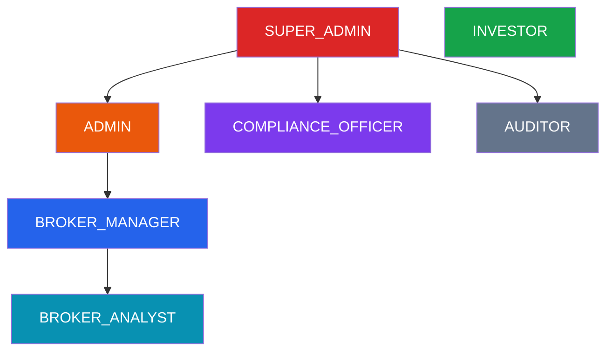
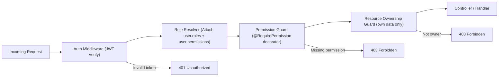
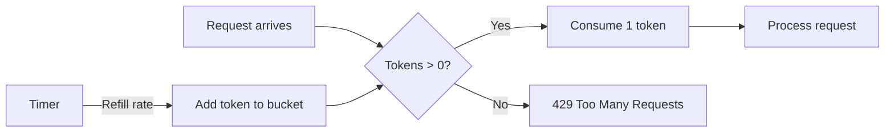
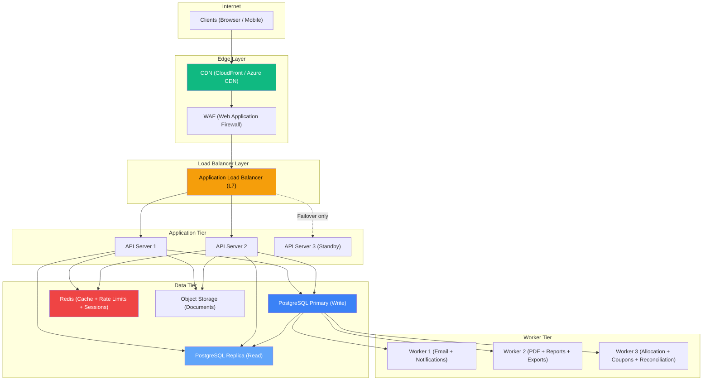
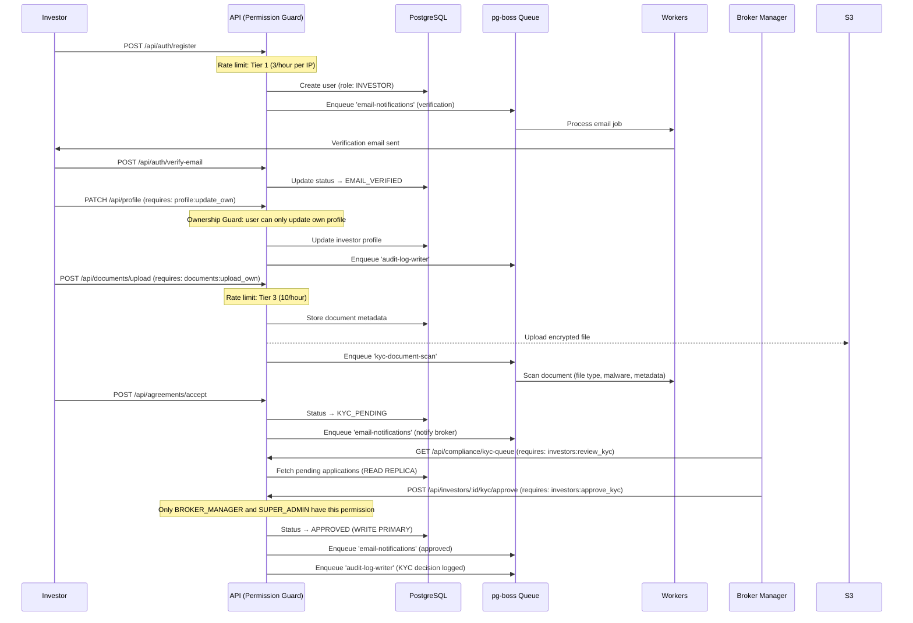
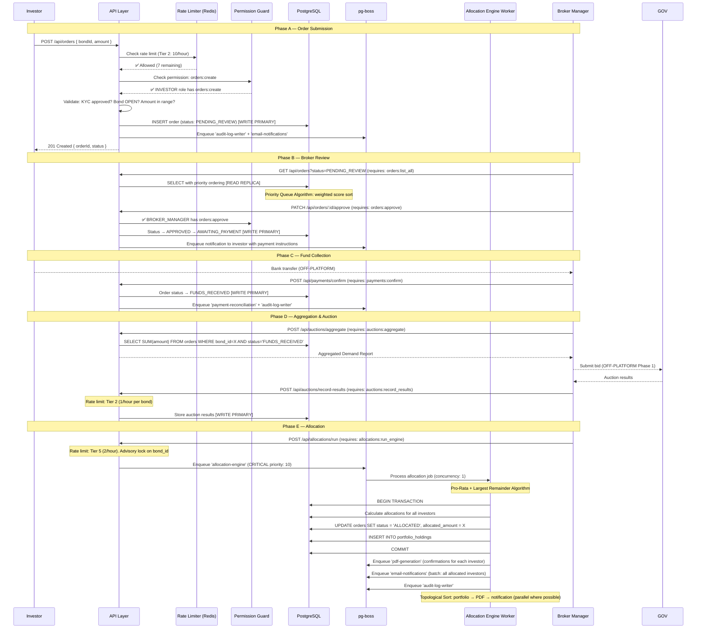
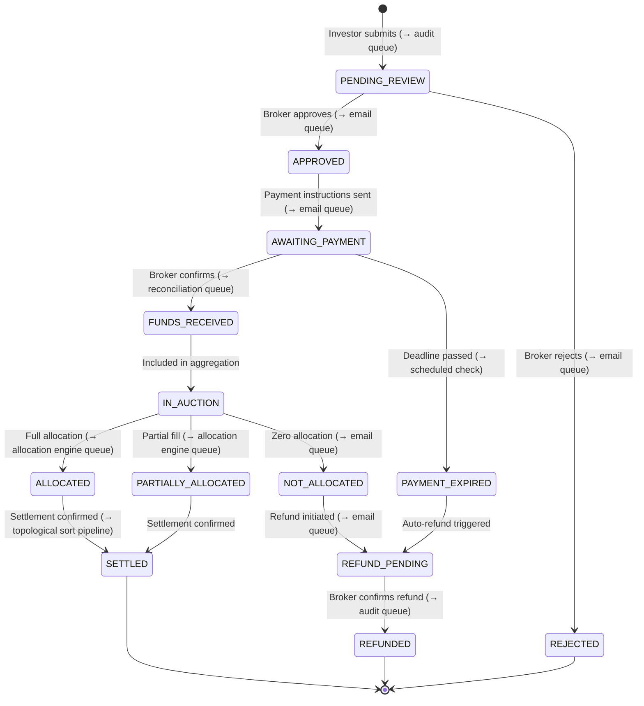
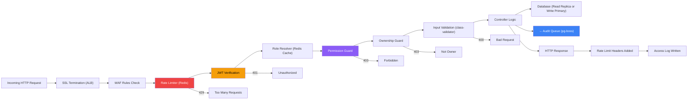

# AFIN — Enhanced Workflow & Technical Architecture Guide

## Table of Contents

1. [RBAC System Design](#1--rbac-system-design)
2. [Rate Limiting Strategy](#2--rate-limiting-strategy)
3. [pg-boss Job Queue Architecture](#3--pg-boss-job-queue-architecture)
4. [DSA & Algorithms Map](#4--dsa--algorithms-map)
5. [Load Balancer Topology](#5--load-balancer-topology)
6. [Enhanced Workflows](#6--enhanced-workflows)

---

# 1 — RBAC System Design

## Role Hierarchy

The system uses a **hierarchical RBAC** model. Higher roles inherit permissions from lower ones where applicable, but roles are also **domain-separated** — a Broker role never inherits Investor permissions and vice versa.



## Role Definitions

| Role | Code | Description | Domain |
|------|------|------------|--------|
| **Super Admin** | `SUPER_ADMIN` | Full system access. Creates admins, configures tenants, manages infrastructure settings. Only 1–2 users. | Platform |
| **Admin** | `ADMIN` | Manages users, configures countries/brokers, views audit logs, manages system settings. Cannot modify RBAC roles. | Platform |
| **Compliance Officer** | `COMPLIANCE_OFFICER` | Reviews KYC/AML, views audit trails, manages compliance records. Read-only on financial operations. Cannot approve orders. | Compliance |
| **Broker Manager** | `BROKER_MANAGER` | Full broker operations: publishes bonds, approves orders, runs allocations, manages settlements, generates reports. | Broker |
| **Broker Analyst** | `BROKER_ANALYST` | Read-heavy role: views orders, monitors demand, generates reports. Cannot approve orders, run allocations, or publish bonds. | Broker |
| **Auditor** | `AUDITOR` | Read-only access to audit logs, compliance records, reports. Cannot modify anything. External auditor access. | Compliance |
| **Investor** | `INVESTOR` | Self-service: registers, completes KYC, browses bonds, submits orders, views portfolio. No access to broker operations. | Investor |

> [!IMPORTANT]
> Roles are **not** just labels — they map to a **permission set**. The middleware checks `user.permissions.includes('orders:approve')`, not `user.role === 'BROKER_MANAGER'`. This allows fine-grained customization without code changes.

---

## Permission Model

### Permission Naming Convention

```
<resource>:<action>

Examples:
  bonds:create
  bonds:publish
  orders:approve
  investors:review_kyc
  audit:read
  system:configure
```

### Complete Permission Matrix

#### Investor Domain

| Permission | INVESTOR | BROKER_ANALYST | BROKER_MANAGER | COMPLIANCE_OFFICER | ADMIN | SUPER_ADMIN |
|-----------|:--------:|:--------------:|:--------------:|:-----------------:|:-----:|:-----------:|
| `profile:read_own` | ✅ | — | — | — | — | ✅ |
| `profile:update_own` | ✅ | — | — | — | — | ✅ |
| `documents:upload_own` | ✅ | — | — | — | — | ✅ |
| `documents:read_own` | ✅ | — | — | — | — | ✅ |
| `bonds:browse` | ✅ | ✅ | ✅ | — | — | ✅ |
| `bonds:view_details` | ✅ | ✅ | ✅ | — | — | ✅ |
| `orders:create` | ✅ | — | — | — | — | ✅ |
| `orders:read_own` | ✅ | — | — | — | — | ✅ |
| `orders:cancel_own` | ✅ | — | — | — | — | ✅ |
| `portfolio:read_own` | ✅ | — | — | — | — | ✅ |
| `statements:download_own` | ✅ | — | — | — | — | ✅ |
| `notifications:read_own` | ✅ | — | — | — | — | ✅ |

#### Broker Domain

| Permission | BROKER_ANALYST | BROKER_MANAGER | COMPLIANCE_OFFICER | ADMIN | SUPER_ADMIN |
|-----------|:--------------:|:--------------:|:-----------------:|:-----:|:-----------:|
| `investors:list` | ✅ | ✅ | ✅ | ✅ | ✅ |
| `investors:view_profile` | ✅ | ✅ | ✅ | ✅ | ✅ |
| `investors:review_kyc` | — | ✅ | ✅ | — | ✅ |
| `investors:approve_kyc` | — | ✅ | — | — | ✅ |
| `investors:reject_kyc` | — | ✅ | — | — | ✅ |
| `bonds:create` | — | ✅ | — | — | ✅ |
| `bonds:update` | — | ✅ | — | — | ✅ |
| `bonds:publish` | — | ✅ | — | — | ✅ |
| `bonds:archive` | — | ✅ | — | — | ✅ |
| `orders:list_all` | ✅ | ✅ | — | — | ✅ |
| `orders:view_details` | ✅ | ✅ | — | — | ✅ |
| `orders:approve` | — | ✅ | — | — | ✅ |
| `orders:reject` | — | ✅ | — | — | ✅ |
| `payments:list` | ✅ | ✅ | — | — | ✅ |
| `payments:confirm` | — | ✅ | — | — | ✅ |
| `auctions:aggregate` | ✅ | ✅ | — | — | ✅ |
| `auctions:submit` | — | ✅ | — | — | ✅ |
| `auctions:record_results` | — | ✅ | — | — | ✅ |
| `allocations:run_engine` | — | ✅ | — | — | ✅ |
| `allocations:view` | ✅ | ✅ | — | — | ✅ |
| `allocations:confirm` | — | ✅ | — | — | ✅ |
| `coupons:record_payment` | — | ✅ | — | — | ✅ |
| `coupons:view` | ✅ | ✅ | — | — | ✅ |
| `reports:generate` | ✅ | ✅ | ✅ | ✅ | ✅ |
| `reports:download` | ✅ | ✅ | ✅ | ✅ | ✅ |
| `reports:schedule` | — | ✅ | — | ✅ | ✅ |

#### Compliance & Admin Domain

| Permission | AUDITOR | COMPLIANCE_OFFICER | ADMIN | SUPER_ADMIN |
|-----------|:-------:|:-----------------:|:-----:|:-----------:|
| `audit:read` | ✅ | ✅ | ✅ | ✅ |
| `audit:export` | ✅ | ✅ | ✅ | ✅ |
| `compliance:view_kyc_queue` | — | ✅ | ✅ | ✅ |
| `compliance:view_aml_status` | — | ✅ | ✅ | ✅ |
| `compliance:flag_account` | — | ✅ | — | ✅ |
| `compliance:clear_flag` | — | ✅ | — | ✅ |
| `users:list` | — | — | ✅ | ✅ |
| `users:create` | — | — | ✅ | ✅ |
| `users:update` | — | — | ✅ | ✅ |
| `users:deactivate` | — | — | ✅ | ✅ |
| `users:assign_role` | — | — | — | ✅ |
| `roles:manage` | — | — | — | ✅ |
| `system:configure` | — | — | ✅ | ✅ |
| `countries:manage` | — | — | ✅ | ✅ |
| `brokers:manage` | — | — | ✅ | ✅ |
| `integrations:manage` | — | — | — | ✅ |

---

## RBAC Implementation Architecture



### Database Schema for RBAC

```sql
-- Roles table
CREATE TABLE roles (
  id UUID PRIMARY KEY DEFAULT gen_random_uuid(),
  name VARCHAR(50) UNIQUE NOT NULL,       -- e.g. 'BROKER_MANAGER'
  display_name VARCHAR(100) NOT NULL,     -- e.g. 'Broker Manager'
  description TEXT,
  is_system BOOLEAN DEFAULT true,         -- system roles can't be deleted
  parent_role_id UUID REFERENCES roles(id),
  created_at TIMESTAMPTZ DEFAULT NOW()
);

-- Permissions table
CREATE TABLE permissions (
  id UUID PRIMARY KEY DEFAULT gen_random_uuid(),
  code VARCHAR(100) UNIQUE NOT NULL,      -- e.g. 'orders:approve'
  resource VARCHAR(50) NOT NULL,          -- e.g. 'orders'
  action VARCHAR(50) NOT NULL,            -- e.g. 'approve'
  description TEXT,
  created_at TIMESTAMPTZ DEFAULT NOW()
);

-- Role-Permission junction (which roles have which permissions)
CREATE TABLE role_permissions (
  role_id UUID REFERENCES roles(id) ON DELETE CASCADE,
  permission_id UUID REFERENCES permissions(id) ON DELETE CASCADE,
  PRIMARY KEY (role_id, permission_id)
);

-- User-Role junction (which users have which roles)
CREATE TABLE user_roles (
  user_id UUID REFERENCES users(id) ON DELETE CASCADE,
  role_id UUID REFERENCES roles(id) ON DELETE CASCADE,
  assigned_by UUID REFERENCES users(id),
  assigned_at TIMESTAMPTZ DEFAULT NOW(),
  PRIMARY KEY (user_id, role_id)
);

-- Optional: Direct user-permission overrides (for edge cases)
CREATE TABLE user_permission_overrides (
  user_id UUID REFERENCES users(id) ON DELETE CASCADE,
  permission_id UUID REFERENCES permissions(id) ON DELETE CASCADE,
  granted BOOLEAN NOT NULL,               -- true = grant, false = deny
  reason TEXT,
  granted_by UUID REFERENCES users(id),
  granted_at TIMESTAMPTZ DEFAULT NOW(),
  PRIMARY KEY (user_id, permission_id)
);
```

### Permission Resolution Algorithm

```
function resolvePermissions(userId):
    // 1. Get all roles assigned to user
    roles = getUserRoles(userId)
    
    // 2. For each role, walk up the parent chain (role hierarchy)
    allRoles = Set()
    for role in roles:
        current = role
        while current != null:
            allRoles.add(current)
            current = current.parentRole
    
    // 3. Collect all permissions from all resolved roles
    permissions = Set()
    for role in allRoles:
        permissions.addAll(getRolePermissions(role))
    
    // 4. Apply user-level overrides
    overrides = getUserOverrides(userId)
    for override in overrides:
        if override.granted:
            permissions.add(override.permission)
        else:
            permissions.remove(override.permission)  // deny wins
    
    return permissions
```

> [!NOTE]
> The resolved permission set is **cached in Redis** with a TTL of 5 minutes. Any role or permission change triggers a cache invalidation event. This avoids hitting the database on every request.

---

# 2 — Rate Limiting Strategy

## Why Rate Limiting?

| Threat | Without Rate Limiting |
|--------|----------------------|
| Credential stuffing | Attackers try thousands of login combos |
| Order spam | Scripts submit fake orders flooding the queue |
| Report DoS | Heavy report generation kills the database |
| Document upload abuse | Massive file uploads consume storage |
| API scraping | Competitors or bots scrape bond data |
| Allocation engine abuse | Repeated triggers crash computation |

## Rate Limiting Algorithms Used

### Token Bucket — For Burst-Tolerant Endpoints

Used where we want to allow short bursts but enforce an average rate.

```
Algorithm: Token Bucket
- Bucket has a max capacity (burst size)
- Tokens refill at a fixed rate per second
- Each request consumes 1 token
- If bucket is empty → 429 Too Many Requests

Example: Login endpoint
  - Bucket size: 5 (allows 5 rapid attempts)
  - Refill rate: 1 token per 30 seconds
  - Result: 5 quick tries, then 1 every 30s
```



### Sliding Window Log — For Strict Endpoints

Used where we need exact counting without burst tolerance.

```
Algorithm: Sliding Window Log
- Store timestamp of every request in a sorted set (Redis ZSET)
- On new request: remove entries older than window, count remaining
- If count >= limit → 429

Example: Order creation
  - Window: 1 hour
  - Limit: 10 orders
  - Result: Exactly 10 orders per rolling hour, no bursts
```

---

## Rate Limit Tiers by Endpoint

### Tier 1 — Critical Security (Strictest)

| Endpoint | Limit | Window | Algorithm | Key | Penalty |
|----------|-------|--------|-----------|-----|---------|
| `POST /api/auth/login` | 5 req | 15 min | Token Bucket | IP + email | Lock account 30 min after 10 fails |
| `POST /api/auth/register` | 3 req | 1 hour | Sliding Window | IP | Block IP 1 hour |
| `POST /api/auth/forgot-password` | 3 req | 1 hour | Sliding Window | IP + email | Silent drop after limit |
| `POST /api/auth/reset-password` | 3 req | 1 hour | Sliding Window | Token | Invalidate token |
| `POST /api/auth/verify-email` | 5 req | 15 min | Token Bucket | User ID | Re-send cooldown |

### Tier 2 — Financial Operations (Strict)

| Endpoint | Limit | Window | Algorithm | Key | Rationale |
|----------|-------|--------|-----------|-----|-----------|
| `POST /api/orders` | 10 req | 1 hour | Sliding Window | User ID | Prevent order spam |
| `PATCH /api/orders/:id/cancel` | 5 req | 1 hour | Sliding Window | User ID | Prevent cancel abuse |
| `POST /api/payments/confirm` | 20 req | 1 hour | Token Bucket | User ID (Broker) | Batch confirms OK |
| `POST /api/allocations/run` | 2 req | 1 hour | Sliding Window | Bond ID | Heavy computation |
| `POST /api/auctions/submit` | 1 req | 1 hour | Sliding Window | Bond ID | One submission per auction |
| `POST /api/coupons/record` | 10 req | 1 hour | Token Bucket | User ID (Broker) | Batch records OK |

### Tier 3 — Data Mutation (Moderate)

| Endpoint | Limit | Window | Algorithm | Key |
|----------|-------|--------|-----------|-----|
| `POST /api/bonds` | 10 req | 1 hour | Token Bucket | User ID |
| `PATCH /api/bonds/:id` | 20 req | 1 hour | Token Bucket | User ID |
| `POST /api/investors/:id/kyc/approve` | 30 req | 1 hour | Token Bucket | User ID |
| `POST /api/documents/upload` | 10 req | 1 hour | Sliding Window | User ID |
| `PATCH /api/profile` | 10 req | 1 hour | Token Bucket | User ID |

### Tier 4 — Read Operations (Generous)

| Endpoint | Limit | Window | Algorithm | Key |
|----------|-------|--------|-----------|-----|
| `GET /api/bonds` | 100 req | 1 min | Token Bucket | User ID |
| `GET /api/portfolio` | 60 req | 1 min | Token Bucket | User ID |
| `GET /api/orders` | 60 req | 1 min | Token Bucket | User ID |
| `GET /api/reports/*` | 20 req | 1 hour | Sliding Window | User ID |
| `GET /api/audit/*` | 30 req | 1 min | Token Bucket | User ID |

### Tier 5 — Heavy Computation (Very Strict)

| Endpoint | Limit | Window | Algorithm | Key | Reason |
|----------|-------|--------|-----------|-----|--------|
| `POST /api/reports/generate` | 5 req | 1 hour | Sliding Window | User ID | CPU + DB intensive |
| `GET /api/reports/export/csv` | 3 req | 1 hour | Sliding Window | User ID | Large data export |
| `POST /api/statements/generate` | 3 req | 1 hour | Sliding Window | User ID | PDF generation |
| `POST /api/allocations/simulate` | 5 req | 1 hour | Sliding Window | User ID | Complex calculation |

### Implementation (Redis-based)

```
Rate limit headers on every response:
  X-RateLimit-Limit: 100
  X-RateLimit-Remaining: 73
  X-RateLimit-Reset: 1720612800   (Unix timestamp)
  Retry-After: 30                 (seconds, only on 429)
```

---

# 3 — pg-boss Job Queue Architecture

## Why pg-boss?

pg-boss uses **PostgreSQL as the queue backend** — no Redis or RabbitMQ dependency for the queue itself. This is ideal for Phase 1 because:

- Transactional guarantees (jobs are created inside the same DB transaction as the triggering action)
- No additional infrastructure to manage
- Built-in retry, expiration, scheduling, and dead-letter queues
- Good enough throughput for Phase 1 scale (thousands of jobs/day)

## Queue Architecture Overview

```mermaid
graph TB
    subgraph "API Layer (Producers)"
        A1["Auth Controller"]
        A2["Order Controller"]
        A3["Allocation Controller"]
        A4["Payment Controller"]
        A5["Bond Controller"]
        A6["Report Controller"]
        A7["KYC Controller"]
    end

    subgraph "pg-boss Queue (PostgreSQL)"
        Q1["📧 email-notifications"]
        Q2["🔔 push-notifications"]
        Q3["📄 pdf-generation"]
        Q4["⚙️ allocation-engine"]
        Q5["💰 coupon-calculator"]
        Q6["📊 report-generation"]
        Q7["🔍 kyc-document-scan"]
        Q8["📝 audit-log-writer"]
        Q9["🔄 payment-reconciliation"]
        Q10["📅 scheduled-maturity-check"]
        Q11["🧹 data-cleanup"]
        Q12["📤 export-jobs"]
    end

    subgraph "Workers (Consumers)"
        W1["Email Worker (concurrency: 5)"]
        W2["Notification Worker (concurrency: 3)"]
        W3["PDF Worker (concurrency: 2)"]
        W4["Allocation Worker (concurrency: 1)"]
        W5["Coupon Worker (concurrency: 1)"]
        W6["Report Worker (concurrency: 2)"]
        W7["KYC Scan Worker (concurrency: 3)"]
        W8["Audit Writer (concurrency: 10)"]
        W9["Reconciliation Worker (concurrency: 1)"]
        W10["Scheduler Worker (cron)"]
        W11["Cleanup Worker (cron)"]
        W12["Export Worker (concurrency: 2)"]
    end

    A1 --> Q1
    A2 --> Q1
    A2 --> Q8
    A3 --> Q4
    A3 --> Q3
    A4 --> Q9
    A5 --> Q1
    A6 --> Q6
    A7 --> Q7

    Q1 --> W1
    Q2 --> W2
    Q3 --> W3
    Q4 --> W4
    Q5 --> W5
    Q6 --> W6
    Q7 --> W7
    Q8 --> W8
    Q9 --> W9
    Q10 --> W10
    Q11 --> W11
    Q12 --> W12
```



## Queue Definitions

### 1. `email-notifications`

| Property | Value |
|----------|-------|
| **Trigger** | User registration, KYC decision, order status change, payment confirmation, allocation complete, coupon payment, bond published |
| **Priority** | Medium (`5`) |
| **Concurrency** | 5 workers |
| **Retry** | 3 attempts, exponential backoff (30s, 2min, 10min) |
| **Expiry** | 24 hours |
| **Dead Letter Queue** | `email-notifications-dlq` |

```json
{
  "name": "email-notifications",
  "data": {
    "template": "order_approved",
    "to": "investor@example.com",
    "variables": {
      "investorName": "João Silva",
      "bondName": "OT 10.5% 2031",
      "amount": 500000,
      "currency": "MZN"
    }
  }
}
```

### 2. `push-notifications`

| Property | Value |
|----------|-------|
| **Trigger** | Same as email but for in-app + mobile push |
| **Priority** | Medium (`5`) |
| **Concurrency** | 3 workers |
| **Retry** | 2 attempts, 1 min backoff |
| **Expiry** | 4 hours (stale notifications are useless) |

### 3. `pdf-generation`

| Property | Value |
|----------|-------|
| **Trigger** | Allocation confirmation, investor statement request, report export |
| **Priority** | Low (`3`) |
| **Concurrency** | 2 workers (CPU-intensive) |
| **Retry** | 2 attempts, 5 min backoff |
| **Expiry** | 2 hours |
| **Max Job Size** | 50 pages per PDF |

### 4. `allocation-engine` ⚡

| Property | Value |
|----------|-------|
| **Trigger** | Broker clicks "Run Allocation" after entering auction results |
| **Priority** | **Critical (`10`)** |
| **Concurrency** | **1 worker** (serial processing — MUST NOT run in parallel) |
| **Retry** | 1 attempt only (manual re-trigger required) |
| **Expiry** | 30 minutes |
| **Timeout** | 10 minutes |
| **Lock** | Advisory lock on `bond_id` to prevent concurrent allocation |

> [!CAUTION]
> The allocation engine MUST run single-threaded per bond. Running two allocations simultaneously for the same bond would corrupt investor portfolios. We use a PostgreSQL advisory lock + pg-boss singleton pattern.

### 5. `coupon-calculator`

| Property | Value |
|----------|-------|
| **Trigger** | Cron schedule: daily at 06:00 UTC — checks for coupons due within 7 days |
| **Priority** | High (`8`) |
| **Concurrency** | 1 worker |
| **Schedule** | `0 6 * * *` (daily) |
| **Retry** | 3 attempts |

### 6. `report-generation`

| Property | Value |
|----------|-------|
| **Trigger** | User requests report, scheduled report |
| **Priority** | Low (`2`) |
| **Concurrency** | 2 workers |
| **Retry** | 2 attempts, 5 min backoff |
| **Expiry** | 1 hour |

### 7. `kyc-document-scan`

| Property | Value |
|----------|-------|
| **Trigger** | Investor uploads identity document |
| **Priority** | High (`7`) |
| **Concurrency** | 3 workers |
| **Retry** | 3 attempts |
| **Purpose** | Validates file type, scans for malware, extracts metadata, checks file integrity. In Phase 2, integrates with external KYC provider API |

### 8. `audit-log-writer`

| Property | Value |
|----------|-------|
| **Trigger** | Every state-changing API call |
| **Priority** | High (`8`) — must not be lost |
| **Concurrency** | 10 workers (high throughput) |
| **Retry** | 5 attempts (audit logs are critical) |
| **Expiry** | Never (retry indefinitely) |
| **Batching** | Batches up to 50 log entries per write |

> [!IMPORTANT]
> Audit logs are written asynchronously via the queue to avoid slowing down API responses. However, the job is created in the **same database transaction** as the triggering action — so if the transaction rolls back, the audit job is also rolled back. This guarantees consistency.

### 9. `payment-reconciliation`

| Property | Value |
|----------|-------|
| **Trigger** | Cron schedule: every 4 hours. In Phase 2, triggered by bank webhook |
| **Priority** | Medium (`5`) |
| **Concurrency** | 1 worker |
| **Schedule** | `0 */4 * * *` |

### 10. `scheduled-maturity-check`

| Property | Value |
|----------|-------|
| **Trigger** | Cron: daily at 07:00 UTC |
| **Priority** | Medium (`5`) |
| **Schedule** | `0 7 * * *` |
| **Purpose** | Finds bonds maturing within 30/7/1 day windows, creates notification jobs |

### 11. `data-cleanup`

| Property | Value |
|----------|-------|
| **Trigger** | Cron: weekly, Sunday 02:00 UTC |
| **Schedule** | `0 2 * * 0` |
| **Purpose** | Purge expired sessions, clean temp files, archive old notifications |

### 12. `export-jobs`

| Property | Value |
|----------|-------|
| **Trigger** | User requests CSV/Excel export of large datasets |
| **Priority** | Low (`2`) |
| **Concurrency** | 2 workers |
| **Retry** | 2 attempts |
| **Expiry** | 1 hour |

---

## Queue Monitoring Dashboard (Broker/Admin)

| Metric | Source |
|--------|--------|
| Active jobs per queue | `pg-boss` stats |
| Failed jobs (last 24h) | Dead letter queue count |
| Average processing time | Job completion timestamps |
| Queue depth trend | Time-series of pending jobs |
| Worker health | Heartbeat checks |

---

# 4 — DSA & Algorithms Map

Every non-trivial computation in the platform uses a specific algorithm. Here's where each one applies.

## Algorithm 1: Pro-Rata Allocation (Proportional Distribution)

**Where**: Allocation Engine — distributing bonds to investors when a bond is oversubscribed.

```
Problem: Government allocated 3,000,000 MZN of bonds.
         Total investor demand is 5,000,000 MZN.
         How much does each investor get?

Algorithm: Weighted Proportional Allocation with Floor + Remainder Distribution

Input:
  totalAllocated = 3,000,000
  orders = [
    { investorId: "A", requested: 2,000,000 },  // 40% of demand
    { investorId: "B", requested: 1,500,000 },  // 30% of demand
    { investorId: "C", requested: 1,000,000 },  // 20% of demand
    { investorId: "D", requested:   500,000 },  // 10% of demand
  ]
  faceValue = 1,000  // minimum allocation unit

Steps:
  1. Calculate each investor's share ratio:
     ratio_i = order_i.requested / totalDemand

  2. Calculate raw allocation:
     raw_i = totalAllocated × ratio_i

  3. Floor to nearest face value unit:
     floored_i = floor(raw_i / faceValue) × faceValue

  4. Calculate remainder:
     remainder = totalAllocated - sum(floored_i)

  5. Distribute remainder units by largest-remainder method:
     - Sort investors by (raw_i - floored_i) descending
     - Assign one face value unit to each until remainder = 0

Result:
  A: 1,200,000 MZN (40%)
  B:   900,000 MZN (30%)
  C:   600,000 MZN (20%)
  D:   300,000 MZN (10%)

Time Complexity: O(n log n) — dominated by the sort step
Space Complexity: O(n)
```

> [!TIP]
> The **largest-remainder method** (also called Hamilton's method) is the same algorithm used in parliamentary seat allocation. It ensures fair rounding while maintaining the exact total.

---

## Algorithm 2: Priority Queue (Min-Heap) — Order Processing

**Where**: Broker order review queue — orders are processed by priority, not just FIFO.

```
Priority factors (weighted scoring):
  - Subscription deadline proximity:  weight 0.4 (closer = higher priority)
  - Investment amount:                weight 0.3 (larger = higher priority)
  - Investor tier:                    weight 0.2 (institutional > retail)
  - Submission time (FIFO tiebreak):  weight 0.1 (earlier = higher priority)

Data Structure: Binary Min-Heap on priority score
  - Insert order:    O(log n)
  - Get next order:  O(1)
  - Remove top:      O(log n)

Implementation: Use PostgreSQL with an indexed priority column
  SELECT * FROM orders
  WHERE status = 'PENDING_REVIEW'
  ORDER BY priority_score DESC, created_at ASC
  LIMIT 20;

Index:
  CREATE INDEX idx_orders_priority
  ON orders (status, priority_score DESC, created_at ASC)
  WHERE status = 'PENDING_REVIEW';
```

---

## Algorithm 3: Sliding Window — Rate Limiting

**Where**: API rate limiter (see Section 2).

```
Data Structure: Redis Sorted Set (ZSET)
  Key: rate_limit:{user_id}:{endpoint}
  Members: request timestamps (score = timestamp)

On each request:
  1. ZREMRANGEBYSCORE key 0 (now - window_size)   // prune old entries
  2. count = ZCARD key                             // count remaining
  3. if count >= limit: return 429
  4. ZADD key now now                              // add this request
  5. EXPIRE key window_size                        // auto-cleanup

Time Complexity: O(log n) per request
Space Complexity: O(limit) per key — bounded by the limit
```

---

## Algorithm 4: Token Bucket — Burst Rate Limiting

**Where**: Read-heavy endpoints, login attempts.

```
Data Structure: Redis Hash
  Key: token_bucket:{user_id}:{endpoint}
  Fields: { tokens: number, last_refill: timestamp }

On each request:
  1. elapsed = now - last_refill
  2. new_tokens = elapsed × refill_rate
  3. tokens = min(tokens + new_tokens, max_bucket_size)
  4. last_refill = now
  5. if tokens >= 1:
       tokens -= 1
       allow request
     else:
       return 429

Time Complexity: O(1) per request
Space Complexity: O(1) per key
```

---

## Algorithm 5: Trie (Prefix Tree) — Bond & Investor Search

**Where**: Autocomplete search in Bond Marketplace and Investor List.

```
Problem: User types "OT 10" → suggest matching bonds
         Broker types "Sil" → suggest matching investors

Data Structure: Trie with payload at leaf nodes
  - Each node stores a character
  - Leaf nodes store the matching entity ID + display text
  - Supports prefix matching in O(k) where k = query length

Implementation: For Phase 1, PostgreSQL trigram index is sufficient:

  CREATE EXTENSION pg_trgm;

  CREATE INDEX idx_bonds_name_trgm
  ON bonds USING gin (name gin_trgm_ops);

  CREATE INDEX idx_investors_name_trgm
  ON investors USING gin (
    (first_name || ' ' || last_name) gin_trgm_ops
  );

  -- Query:
  SELECT * FROM bonds
  WHERE name ILIKE '%OT 10%'
  ORDER BY similarity(name, 'OT 10') DESC
  LIMIT 10;

Time Complexity: O(k) for trie lookup, O(n × trigram match) for pg_trgm
Phase 2: Move to Elasticsearch / Meilisearch for full-text search
```

---

## Algorithm 6: Topological Sort — Settlement Dependency Resolution

**Where**: Settlement engine — determining the correct order of operations when settling multiple related transactions.

```
Problem: Settlement has dependencies:
  - Allocation must complete before portfolio update
  - Portfolio update must complete before confirmation
  - Confirmation must complete before notification
  - Some operations can run in parallel

Model as DAG (Directed Acyclic Graph):

  allocation_complete
       ├── update_portfolio
       │     ├── generate_confirmation_pdf
       │     │     └── send_notification
       │     └── update_aum_report
       └── record_settlement_in_audit

Algorithm: Kahn's Algorithm (BFS-based topological sort)
  1. Build adjacency list + in-degree count
  2. Initialize queue with nodes having in-degree 0
  3. While queue is not empty:
     - Dequeue node, process it
     - For each neighbor: decrement in-degree
     - If in-degree becomes 0: enqueue it
  4. If processed count != total nodes: cycle detected (error)

Time Complexity: O(V + E) where V = steps, E = dependencies
Space Complexity: O(V + E)

Benefit: Steps at the same "level" can execute in PARALLEL
  Level 0: [allocation_complete]
  Level 1: [update_portfolio, record_settlement_in_audit]  ← PARALLEL
  Level 2: [generate_confirmation_pdf, update_aum_report]  ← PARALLEL
  Level 3: [send_notification]
```

---

## Algorithm 7: Coupon Schedule Calculator (Date Arithmetic)

**Where**: Portfolio dashboard — generating the full coupon schedule for a bond.

```
Input:
  issueDate = 2025-07-15
  maturityDate = 2031-07-15
  couponRate = 10.5%
  couponFrequency = "semi-annual"  // or annual, quarterly
  faceValue = 1,000,000 MZN
  dayCountConvention = "30/360"    // or "ACT/365"

Algorithm:
  1. Determine period months = 12 / frequency (semi-annual = 6)
  2. Generate payment dates:
     date = issueDate + periodMonths
     while date <= maturityDate:
       schedule.push(date)
       date += periodMonths
  3. Calculate per-period coupon:
     if dayCountConvention == "30/360":
       periodCoupon = faceValue × (couponRate / frequency)
     else if dayCountConvention == "ACT/365":
       actualDays = daysBetween(prevDate, date)
       periodCoupon = faceValue × couponRate × (actualDays / 365)
  4. Last payment includes principal:
     schedule[last].amount += faceValue

Time Complexity: O(n) where n = number of coupon periods
```

---

## Algorithm 8: B-Tree Indexed Range Queries — Audit Log Search

**Where**: Compliance audit log search across millions of records.

```
Problem: "Show me all actions by user X between Jan 1 and Mar 31 2025"

Data Structure: PostgreSQL B-Tree composite index

  CREATE INDEX idx_audit_user_time
  ON audit_logs (actor_id, created_at DESC);

  CREATE INDEX idx_audit_resource_time
  ON audit_logs (resource_type, resource_id, created_at DESC);

  -- Partitioning by month for very large tables:
  CREATE TABLE audit_logs (
    id UUID,
    actor_id UUID,
    action VARCHAR(100),
    created_at TIMESTAMPTZ
  ) PARTITION BY RANGE (created_at);

  CREATE TABLE audit_logs_2025_q1
    PARTITION OF audit_logs
    FOR VALUES FROM ('2025-01-01') TO ('2025-04-01');

Query performance: O(log n) for B-Tree seek + O(k) for k results
With partitioning: Only scans the relevant partition → 4x speedup
```

---

## Algorithm Summary Table

| # | Algorithm | Where Applied | Time Complexity | Why This Algorithm |
|---|-----------|--------------|-----------------|-------------------|
| 1 | Pro-Rata + Largest Remainder | Allocation Engine | O(n log n) | Fair proportional distribution with exact totals |
| 2 | Priority Queue (Heap) | Order Processing | O(log n) insert | Multi-factor priority ordering |
| 3 | Sliding Window Log | Rate Limiting (strict) | O(log n) | Exact count in rolling window |
| 4 | Token Bucket | Rate Limiting (burst) | O(1) | Allows controlled bursts |
| 5 | Trie / Trigram Index | Search Autocomplete | O(k) | Fast prefix matching |
| 6 | Topological Sort (Kahn's) | Settlement Pipeline | O(V+E) | Dependency-safe parallel execution |
| 7 | Date Arithmetic | Coupon Schedule | O(n) | Generate payment calendar |
| 8 | B-Tree + Partitioning | Audit Log Queries | O(log n) | Efficient range scans on millions of rows |

---

# 5 — Load Balancer Topology

## Architecture Overview



## Layer Breakdown

### Layer 1 — CDN (Content Delivery Network)

| What | Details |
|------|---------|
| **Service** | AWS CloudFront or Azure CDN |
| **Caches** | Static assets (JS, CSS, images, fonts) |
| **Does NOT cache** | API responses (dynamic data) |
| **SSL Termination** | Yes — all traffic is HTTPS |
| **Edge Locations** | Mozambique region (Johannesburg), Europe, North America |
| **Cache TTL** | Static: 1 year (content-hashed filenames). HTML: 5 min |

### Layer 2 — WAF (Web Application Firewall)

| Rule | Purpose |
|------|---------|
| SQL injection patterns | Block `'; DROP TABLE` style attacks |
| XSS patterns | Block `<script>` injection |
| Rate limiting (IP level) | Global: 1000 req/min per IP |
| Geo-blocking (optional) | Restrict to allowed countries if required |
| Bot detection | Block known bad bot user-agents |
| File upload scanning | Validate content-type, max size 10 MB |

### Layer 3 — Application Load Balancer (L7)

| Config | Value | Rationale |
|--------|-------|-----------|
| **Algorithm** | **Least Connections** | Better than round-robin when some requests (reports, allocations) take much longer than others |
| **Health Check** | `GET /api/health` every 30s | Returns 200 if DB connected, Redis connected, disk OK |
| **Unhealthy Threshold** | 3 consecutive failures | Node removed from pool after 90 seconds of failure |
| **Sticky Sessions** | **Disabled** | Stateless JWT auth — any server can handle any request |
| **Connection Draining** | 30 seconds | During deploys, finish in-flight requests before stopping |
| **Idle Timeout** | 60 seconds | Close idle keepalive connections |

#### Path-Based Routing Rules

```
/api/reports/*        → Report-optimized servers (more CPU/RAM)
/api/allocations/*    → Allocation server (single instance, advisory lock)
/api/documents/*      → Upload-optimized servers (higher upload limits)
/api/*                → General API pool
/*                    → Next.js frontend servers
```

> [!NOTE]
> In Phase 1, we start with **2 API servers + 1 standby**. The load balancer is still configured because it provides health checking, SSL termination, path-based routing, and zero-downtime deploys even with 2 nodes.

### Layer 4 — Database Read/Write Splitting

```
Write Operations → PostgreSQL Primary
  - INSERT, UPDATE, DELETE
  - Transactions
  - All state-changing operations

Read Operations → PostgreSQL Replica
  - Bond listings (browsing marketplace)
  - Portfolio reads
  - Report data queries
  - Audit log searches
  - Search/autocomplete

Implementation (NestJS):
  @Injectable()
  class DatabaseService {
    // Write connection pool → Primary
    private writePool: Pool;
    
    // Read connection pool → Replica
    private readPool: Pool;
    
    getReadConnection() { return this.readPool; }
    getWriteConnection() { return this.writePool; }
  }
```

### Layer 5 — Redis Topology

| Use Case | Redis DB | TTL |
|----------|----------|-----|
| JWT session cache | DB 0 | 15 min |
| Permission cache | DB 1 | 5 min |
| Rate limit counters | DB 2 | Varies by endpoint |
| Bond listing cache | DB 3 | 30 seconds |
| Report result cache | DB 4 | 10 min |

---

## Scaling Triggers

| Metric | Threshold | Action |
|--------|-----------|--------|
| CPU > 70% sustained 5 min | API tier | Add API server to pool |
| Memory > 80% | API tier | Add API server to pool |
| Response time p95 > 2s | API tier | Investigate + scale |
| Queue depth > 100 jobs | Worker tier | Add worker instance |
| DB connections > 80% max | Data tier | Scale connection pool or add replica |
| Storage > 80% | Object storage | Alert — usually unlimited in cloud |

---

# 6 — Enhanced Workflows

## Enhanced Workflow 1 — Investor Onboarding (with RBAC + Queue)



---

## Enhanced Workflow 3 — Investment Order Cycle (Full Detail)



---

## Enhanced Order Status Machine (with Queue Triggers)



---

## Cross-Cutting Concerns: What Fires On Every Request



---

## System Health Monitoring

| Check | Endpoint | Frequency | Alert If |
|-------|----------|-----------|----------|
| API Health | `GET /api/health` | 30s | 3 consecutive failures |
| DB Primary | TCP check port 5432 | 15s | Connection refused |
| DB Replica | Replication lag query | 60s | Lag > 30 seconds |
| Redis | `PING` | 15s | No `PONG` response |
| pg-boss queues | Queue depth query | 60s | Depth > 100 for > 5 min |
| Dead letter queues | Count check | 5 min | Any entries in DLQ |
| Disk usage | `df` | 5 min | > 80% utilization |
| SSL certificate | Expiry check | Daily | < 30 days to expiry |

---

## Security Layers Summary

| Layer | Technology | What It Protects |
|-------|-----------|-----------------|
| Edge | CDN + WAF | DDoS, injection, bot attacks |
| Transport | TLS 1.3 | Data in transit |
| Auth | JWT + Refresh Tokens | Identity verification |
| Authorization | RBAC + Permission Guards | Resource access control |
| Ownership | Ownership Middleware | Cross-user data access |
| Rate Limiting | Redis (Token Bucket + Sliding Window) | Abuse prevention |
| Input | class-validator + sanitization | Injection, XSS |
| Storage | AES-256 encryption at rest | Document confidentiality |
| Audit | pg-boss async writer | Non-repudiation, compliance |
| Database | Row-level security (optional) | Defense in depth |

---

## What's Next?

When you're ready to start building, I recommend this order:

1. **Database schema** — All tables, indexes, partitions, RBAC seed data
2. **Auth + RBAC** — JWT, role/permission resolution, guards, Redis caching
3. **Investor Onboarding** — Registration, KYC, document upload, approval flow
4. **Bond Marketplace** — CRUD, search, status lifecycle
5. **Order System** — Submit, approve, payment tracking, priority queue
6. **Allocation Engine** — Pro-rata algorithm, settlement pipeline
7. **Portfolio + Coupon System** — Holdings, schedule calculator, coupon tracking
8. **Reports & Compliance** — Report generation, audit log search, export
9. **pg-boss workers** — Email, PDF, scheduled jobs
10. **Load balancer + monitoring** — Health checks, alerting

Let me know when you want to proceed!
