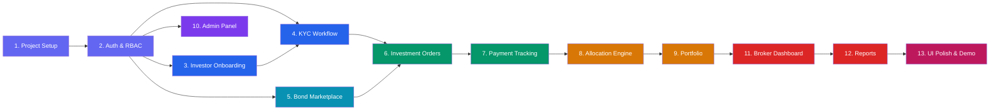

# AFIN MVP — Agile Sprint Plan

## 2-Week / 10-Day Sprint Breakdown

---

# Sprint Board Overview

## Module Dependency Graph

Every module depends on the ones before it. This is the build order:



## Sprint Summary

| Sprint | Days | Story Points | Modules |
|--------|------|-------------|---------|
| **Sprint 1** | Day 1–5 | 55 pts | Setup, Auth, RBAC, Onboarding, KYC, Bonds, Orders |
| **Sprint 2** | Day 6–10 | 45 pts | Payments, Allocation, Portfolio, Admin, Broker Dashboard, Reports, Polish |

## Story Point Scale

| Points | Effort | Example |
|--------|--------|---------|
| 1 | < 1 hour | Add an index, fix a typo |
| 2 | 1–2 hours | Create a simple API endpoint |
| 3 | 2–4 hours | Build a form with validation |
| 5 | 4–6 hours | Full CRUD module with UI |
| 8 | Full day | Complex feature with multiple parts |

---

# SPRINT 1 — Foundation + Core Workflows

---

## DAY 1 — Project Scaffolding + Database + Auth System

**Sprint Goal**: By end of day, a user can register, login, receive JWT tokens, and routes are protected by role.

---

### TASK 1.1 — Project Scaffolding

| Field | Detail |
|-------|--------|
| **Story** | As a developer, I need the project structure set up so that frontend and backend can be developed in parallel. |
| **Points** | 3 |
| **Priority** | P0 — Blocker |
| **Depends On** | Nothing |
| **Blocks** | Every other task |

**Subtasks**:

- [ ] Initialize Next.js 14 project with App Router + TypeScript + Tailwind CSS
- [ ] Initialize NestJS project with TypeScript
- [ ] Configure monorepo structure (`apps/web`, `apps/api`)
- [ ] Set up PostgreSQL database (local Docker or cloud)
- [ ] Configure environment variables (`.env.example`)
- [ ] Set up ESLint + Prettier for both projects
- [ ] Create shared types package or directory
- [ ] Verify both apps run locally (`npm run dev`)

**Acceptance Criteria**:
- ✅ `npm run dev` starts both frontend (port 3000) and backend (port 4000)
- ✅ Backend responds to `GET /api/health` with `{ status: "ok" }`
- ✅ Frontend renders a test page at `localhost:3000`
- ✅ Database connection successful

---

### TASK 1.2 — Database Schema Creation

| Field | Detail |
|-------|--------|
| **Story** | As a developer, I need all database tables created so that modules can store and retrieve data. |
| **Points** | 3 |
| **Priority** | P0 — Blocker |
| **Depends On** | Task 1.1 |
| **Blocks** | All data-related tasks |

**Subtasks**:

- [ ] Set up Prisma ORM (or TypeORM) with PostgreSQL
- [ ] Create migration for `users` table
- [ ] Create migration for `investor_profiles` table
- [ ] Create migration for `documents` table
- [ ] Create migration for `bonds` table
- [ ] Create migration for `orders` table
- [ ] Create migration for `payments` table
- [ ] Create migration for `allocations` table
- [ ] Create migration for `portfolio_holdings` table
- [ ] Create migration for `coupon_payments` table
- [ ] Create migration for `activity_logs` table
- [ ] Create migration for `notifications` table
- [ ] Create migration for `system_settings` table
- [ ] Create migration for `refresh_tokens` table
- [ ] Create `order_number_seq` sequence
- [ ] Create all indexes
- [ ] Run migrations and verify all 14 tables exist

**Acceptance Criteria**:
- ✅ `npx prisma migrate dev` runs without errors
- ✅ All 14 tables visible in database
- ✅ All indexes created
- ✅ Foreign key relationships correct

**Database Tables Touched**: All 14

---

### TASK 1.3 — User Registration API

| Field | Detail |
|-------|--------|
| **Story** | As an investor, I want to register an account so that I can access the platform. |
| **Points** | 3 |
| **Priority** | P0 — Blocker |
| **Depends On** | Task 1.2 |
| **Blocks** | Task 1.4, Task 2.1 |

**Subtasks**:

- [ ] Create `AuthModule` in NestJS
- [ ] Create `RegisterDto` with validation rules:
  - Email: required, valid format, unique
  - Password: required, min 8 chars, 1 uppercase, 1 number
  - First name: required, 2–100 chars
  - Last name: required, 2–100 chars
  - Phone: optional, valid format
- [ ] Implement `POST /api/auth/register`
  - Hash password with bcrypt (12 rounds)
  - Create user with role `INVESTOR` and status `PENDING`
  - Create empty `investor_profile` linked to user
  - Return sanitized user object (no password hash)
- [ ] Add rate limiting: 3 requests per hour per IP
- [ ] Log registration in `activity_logs`
- [ ] Return proper error responses:
  - 400: Validation errors
  - 409: Email already exists

**API Endpoint**:
```
POST /api/auth/register
Body: { email, password, firstName, lastName, phone? }
Response: { user: { id, email, firstName, lastName, role, status }, message }
```

**Acceptance Criteria**:
- ✅ Valid registration creates user + investor_profile
- ✅ Duplicate email returns 409
- ✅ Invalid data returns 400 with field-level errors
- ✅ Password is bcrypt hashed (never stored in plain text)
- ✅ Rate limited to 3/hour per IP

---

### TASK 1.4 — Login + JWT Token System

| Field | Detail |
|-------|--------|
| **Story** | As a registered user, I want to login and receive tokens so that I can access protected resources. |
| **Points** | 5 |
| **Priority** | P0 — Blocker |
| **Depends On** | Task 1.3 |
| **Blocks** | Task 1.5, Task 1.6, and every authenticated feature |

**Subtasks**:

- [ ] Create `LoginDto` (email + password)
- [ ] Implement `POST /api/auth/login`
  - Verify email exists
  - Compare password with bcrypt
  - Check user status (ACTIVE or PENDING allowed, not SUSPENDED/DEACTIVATED)
  - Generate access token (JWT, 15 min expiry, contains: userId, email, role)
  - Generate refresh token (random string, 7-day expiry, stored in `refresh_tokens` table)
  - Log login in `activity_logs`
  - Return both tokens + user profile
- [ ] Implement `POST /api/auth/refresh`
  - Validate refresh token exists and not expired
  - Issue new access token
  - Rotate refresh token (delete old, create new)
- [ ] Implement `POST /api/auth/logout`
  - Delete refresh token from database
  - Log logout in `activity_logs`
- [ ] Implement `POST /api/auth/forgot-password` (mock: just return success message)
- [ ] Add rate limiting on login: 5 attempts per 15 minutes per IP+email

**API Endpoints**:
```
POST /api/auth/login
Body: { email, password }
Response: { accessToken, refreshToken, user: { id, email, firstName, lastName, role, status } }

POST /api/auth/refresh
Body: { refreshToken }
Response: { accessToken, refreshToken }

POST /api/auth/logout
Headers: Authorization: Bearer <token>
Response: { message: "Logged out" }
```

**Acceptance Criteria**:
- ✅ Valid credentials return access token + refresh token
- ✅ Invalid credentials return 401
- ✅ Suspended/deactivated users cannot login
- ✅ Access token expires in 15 minutes
- ✅ Refresh token rotates on use
- ✅ Logout invalidates refresh token
- ✅ Rate limited to 5/15min per IP+email

---

### TASK 1.5 — RBAC Guards + Middleware

| Field | Detail |
|-------|--------|
| **Story** | As a system, I need to enforce role-based access on every API route so that users can only access resources appropriate to their role. |
| **Points** | 5 |
| **Priority** | P0 — Blocker |
| **Depends On** | Task 1.4 |
| **Blocks** | Every protected API endpoint |

**Subtasks**:

- [ ] Create `JwtAuthGuard` — validates access token on every request
  - Extracts token from `Authorization: Bearer <token>` header
  - Verifies signature and expiry
  - Attaches `user` object to request (`req.user = { id, email, role }`)
  - Returns 401 if invalid/expired
- [ ] Create `RolesGuard` — checks if user has required role
  - `@Roles('BROKER', 'ADMIN')` decorator
  - Returns 403 if role not in allowed list
- [ ] Create `OwnershipGuard` — checks if user owns the resource
  - For investor routes: `req.user.id === resource.userId`
  - Returns 403 if not the owner
- [ ] Create role-permission mapping:
  ```
  INVESTOR: [profile:read_own, profile:update_own, documents:upload_own, ...]
  BROKER:   [investors:list, bonds:create, orders:approve, ...]
  ADMIN:    [users:list, users:create, system:configure, ... + all BROKER perms]
  ```
- [ ] Create `@Public()` decorator for unauthenticated routes (login, register)
- [ ] Apply `JwtAuthGuard` globally with `APP_GUARD`
- [ ] Write unit tests for each guard

**Acceptance Criteria**:
- ✅ Unauthenticated request to protected route → 401
- ✅ Investor accessing broker route → 403
- ✅ Broker accessing admin route → 403
- ✅ Investor accessing another investor's data → 403
- ✅ `@Public()` routes work without token
- ✅ Each guard logs the access attempt

**Flow Connection → Next Module**: Once guards work, every subsequent module just adds `@Roles(...)` to its controllers. Auth is the backbone.

---

### TASK 1.6 — Frontend Auth Pages + Auth Context

| Field | Detail |
|-------|--------|
| **Story** | As a user, I want to see a professional login and registration page so that I can access the platform. |
| **Points** | 5 |
| **Priority** | P0 — Blocker |
| **Depends On** | Task 1.4 |
| **Blocks** | All frontend pages |

**Subtasks**:

- [ ] Create `AuthContext` provider in React:
  - Stores: `user`, `accessToken`, `isAuthenticated`, `isLoading`
  - Methods: `login()`, `register()`, `logout()`, `refreshToken()`
  - Auto-refresh: intercept 401 responses → try refresh → retry request
  - Persist tokens in `httpOnly` cookies or localStorage
- [ ] Create API client (`lib/api.ts`):
  - Axios instance with base URL
  - Request interceptor: attach `Authorization` header
  - Response interceptor: handle 401 → refresh → retry
- [ ] Create Login page (`/auth/login`):
  - Email + password form
  - Demo account cards (show credentials for quick demo access)
  - Form validation (client-side)
  - Loading state during API call
  - Error display (toast or inline)
  - On success: redirect based on role:
    - INVESTOR → `/investor/dashboard`
    - BROKER → `/broker/dashboard`
    - ADMIN → `/admin/dashboard`
- [ ] Create Register page (`/auth/register`):
  - First name, Last name, Email, Phone, Password, Confirm password
  - Password strength indicator
  - Terms & conditions checkbox
  - On success: redirect to login with success message
- [ ] Create `ProtectedRoute` wrapper component
- [ ] Create app layout with role-based sidebar navigation
- [ ] Style everything with Tailwind: dark background, gradient accents, Inter font

**Acceptance Criteria**:
- ✅ Login with valid credentials → redirects to correct dashboard
- ✅ Login with invalid credentials → shows error message
- ✅ Register → creates account → redirects to login
- ✅ Accessing `/broker/*` as investor → redirects to `/investor/dashboard`
- ✅ Token refresh works silently in background
- ✅ Logout clears all auth state

**Flow Connection → Next Module**: AuthContext wraps the entire app. Every subsequent page uses `useAuth()` hook and is wrapped in `ProtectedRoute`.

---

### DAY 1 — Definition of Done

- [ ] Both apps running locally
- [ ] 14 database tables created with indexes
- [ ] Register API working with validation
- [ ] Login API working with JWT tokens
- [ ] Refresh token rotation working
- [ ] Role guards enforcing access control on API
- [ ] Login + Register pages styled and functional
- [ ] Role-based redirect after login working
- [ ] Protected route wrapper working
- [ ] Activity log capturing auth events

---

## DAY 2 — Investor Profile + Document Upload + KYC Workflow

**Sprint Goal**: By end of day, an investor can complete their profile and upload documents. A broker can review and approve/reject KYC applications.

**Depends On**: Day 1 (Auth + RBAC must be working)

---

### TASK 2.1 — Investor Profile API

| Field | Detail |
|-------|--------|
| **Story** | As an investor, I want to complete my profile with personal details so that the broker can verify my identity. |
| **Points** | 3 |
| **Priority** | P0 |
| **Depends On** | Task 1.5 (RBAC Guards) |
| **Blocks** | Task 2.3 (KYC depends on profile being complete) |

**Subtasks**:

- [ ] Implement `GET /api/investors/profile` — own profile only
- [ ] Implement `PATCH /api/investors/profile` — update own profile
  - UpdateProfileDto: dateOfBirth, nationality, taxId, address fields
  - If all required fields filled → auto-update KYC status to `PROFILE_COMPLETE`
  - Logs action in `activity_logs`
- [ ] Create `InvestorsModule` in NestJS
- [ ] Create `InvestorProfileService` with business logic

**Acceptance Criteria**:
- ✅ Investor can read and update own profile
- ✅ Broker/Admin cannot access this endpoint (403)
- ✅ Profile update logged in activity_logs

---

### TASK 2.2 — Document Upload System

| Field | Detail |
|-------|--------|
| **Story** | As an investor, I want to upload identification documents so that the broker can verify my identity. |
| **Points** | 5 |
| **Priority** | P0 |
| **Depends On** | Task 2.1 |
| **Blocks** | Task 2.3 (KYC needs documents) |

**Subtasks**:

- [ ] Create file upload service (local, S3-ready architecture)
- [ ] Implement `POST /api/investors/documents` — upload document
  - Validate: PDF, JPEG, PNG only. Max 10 MB
  - Save to `./uploads/{userId}/{filename}`
  - Updates KYC status to `DOCUMENTS_SUBMITTED`
  - Creates notification for broker
- [ ] Implement `GET /api/investors/documents` — list own documents
- [ ] Implement `GET /api/investors/documents/:id` — download (Investor: own, Broker: any)
- [ ] Set up Multer middleware
- [ ] Create drag-and-drop upload component on frontend

**Acceptance Criteria**:
- ✅ Upload PDF/JPEG/PNG up to 10MB
- ✅ Reject invalid file types and oversized files
- ✅ Broker can download investor documents for review

---

### TASK 2.3 — KYC Review Workflow (Broker Side)

| Field | Detail |
|-------|--------|
| **Story** | As a broker, I want to review investor documents and approve or reject their KYC so that only verified investors can invest. |
| **Points** | 5 |
| **Priority** | P0 |
| **Depends On** | Task 2.2 |
| **Blocks** | Task 4.1 (Investors must be KYC-approved to place orders) |

**Subtasks**:

- [ ] Implement `GET /api/investors/kyc-queue` — pending KYC applications
- [ ] Implement `GET /api/investors/:id` — full investor detail for broker
- [ ] Implement `PATCH /api/investors/:id/kyc` — approve/reject/request-info
  - On APPROVE: set kyc_status=APPROVED, user.status=ACTIVE, create notification
  - On REJECT: store reason, create notification
  - On REQUEST_INFO: create notification
- [ ] Implement `GET /api/investors` — broker listing with filters

**Frontend**:
- [ ] Investor Profile page (multi-step form + document upload + KYC status)
- [ ] Broker KYC Queue page (table + document viewer + approve/reject)

**Acceptance Criteria**:
- ✅ Broker sees pending KYC queue
- ✅ Broker approves → investor becomes APPROVED + ACTIVE
- ✅ Broker rejects → investor sees reason
- ✅ All KYC decisions logged + notifications created

**Flow Connection → Next Module**: KYC approval unlocks bond marketplace. Orders (Day 4) check `kyc_status === APPROVED`.

---

### DAY 2 — Definition of Done

- [ ] Investor can complete profile and upload documents
- [ ] Broker can review, approve, reject KYC applications
- [ ] Status changes trigger notifications
- [ ] All actions logged in activity_logs

---

## DAY 3 — Bond Marketplace

**Sprint Goal**: Broker creates bonds, investors browse a professional marketplace.

**Depends On**: Day 1 (Auth), Day 2 (KYC for invest button state)

---

### TASK 3.1 — Bond CRUD API

| Field | Detail |
|-------|--------|
| **Story** | As a broker, I want to create and manage government bond offerings. |
| **Points** | 5 |
| **Depends On** | Task 1.5 (RBAC) |
| **Blocks** | Task 3.2 (Marketplace), Task 4.1 (Orders) |

**Subtasks**:

- [ ] Create `BondsModule` + `CreateBondDto` with validation
- [ ] Implement CRUD: `POST`, `GET /`, `GET /:id`, `PATCH /:id`
  - Investor: sees OPEN bonds only
  - Broker/Admin: sees all statuses
  - Filters + Pagination
- [ ] Implement `PATCH /api/bonds/:id/publish` (DRAFT → OPEN)
  - Notifies all APPROVED investors
- [ ] Implement `PATCH /api/bonds/:id/close` (OPEN → CLOSED)
- [ ] Enforce status flow: DRAFT → OPEN → CLOSED → ALLOCATED → SETTLED

**Bond Status Flow**:
```
DRAFT → OPEN → CLOSED → ALLOCATED → SETTLED
```

---

### TASK 3.2 — Bond Marketplace Frontend

| Field | Detail |
|-------|--------|
| **Story** | As an investor, I want to browse available bonds in a professional marketplace. |
| **Points** | 5 |
| **Depends On** | Task 3.1 |
| **Blocks** | Task 4.2 (Investment form on bond detail page) |

**Subtasks**:

- [ ] Bond Marketplace page: card grid, filters, search, "Invest Now" CTA
- [ ] Bond Detail page: full info + invest button (disabled if KYC not approved)
- [ ] Broker Bond Management page: table + create/edit/publish/close

**Acceptance Criteria**:
- ✅ Marketplace shows OPEN bonds with card layout
- ✅ "Invest" button visible only for KYC-approved investors
- ✅ Broker can create, edit, publish, close bonds

**Flow Connection → Next Module**: "Invest Now" button opens order form (Day 4).

---

### DAY 3 — Definition of Done

- [ ] Broker can create and publish bond offerings
- [ ] Investor marketplace shows OPEN bonds
- [ ] Bond detail page with full information
- [ ] Filters and sorting work
- [ ] "Invest" button ready for Day 4

---

## DAY 4 — Investment Orders

**Sprint Goal**: Investors submit orders, brokers approve/reject them.

**Depends On**: Day 2 (KYC approved), Day 3 (Bonds OPEN)

---

### TASK 4.1 — Order Submission API

| Field | Detail |
|-------|--------|
| **Story** | As a KYC-approved investor, I want to submit an investment order for a bond. |
| **Points** | 5 |
| **Depends On** | Task 2.3 (KYC), Task 3.1 (Bonds) |
| **Blocks** | Task 4.2 |

**Subtasks**:

- [ ] Create `OrdersModule` + `CreateOrderDto`
- [ ] Implement `POST /api/orders` with validation chain:
  1. KYC approved? → else 403
  2. Bond OPEN? → else 400
  3. Deadline not passed? → else 400
  4. Amount >= min? → else 400
  5. Amount <= max? → else 400
  6. No duplicate? → else 409
- [ ] Generate order number: `ORD-{YEAR}-{sequence}`
- [ ] Implement `GET /api/orders/my-orders` — investor's own orders
- [ ] Implement `PATCH /api/orders/:id/cancel` — cancel pending orders

---

### TASK 4.2 — Order Review (Broker Side) + Frontend

| Field | Detail |
|-------|--------|
| **Story** | As a broker, I want to review and approve/reject investment orders. |
| **Points** | 5 |
| **Depends On** | Task 4.1 |
| **Blocks** | Task 5.1 (Payment) |

**Subtasks**:

- [ ] Implement `GET /api/orders` — all orders with filters for broker
- [ ] Implement `PATCH /api/orders/:id/approve` → status: AWAITING_PAYMENT
- [ ] Implement `PATCH /api/orders/:id/reject` with reason
- [ ] Investment form modal on Bond Detail page
- [ ] Investor Orders page with status badges + cancel button
- [ ] Broker Orders page with filter tabs + approve/reject buttons

**Order Status Flow at this point**:
```
PENDING_REVIEW →[Approve]→ AWAITING_PAYMENT
PENDING_REVIEW →[Reject]→ REJECTED
PENDING_REVIEW →[Cancel]→ CANCELLED
```

**Flow Connection → Next Module**: Approved orders are AWAITING_PAYMENT. Day 5 handles payment upload.

---

### DAY 4 — Definition of Done

- [ ] Investor can submit orders with full validation
- [ ] Broker can approve/reject orders
- [ ] Status transitions working with notifications
- [ ] All order actions logged

---

## DAY 5 — Payment Tracking + Allocation Engine + Notifications

**Sprint Goal**: Complete investment lifecycle. invest → pay → verify → allocate → portfolio.

**Depends On**: Day 4 (Orders in AWAITING_PAYMENT)

---

### TASK 5.1 — Payment Receipt Upload + Verification

| Field | Detail |
|-------|--------|
| **Story** | As an investor, I want to upload my payment receipt. As a broker, I want to verify payments. |
| **Points** | 5 |
| **Depends On** | Task 4.2 |
| **Blocks** | Task 5.2 |

**Subtasks**:

- [ ] Create `PaymentsModule`
- [ ] Implement `POST /api/payments/upload-receipt` — upload receipt + update order status
- [ ] Implement `GET /api/payments/my-payments` + `GET /api/payments` (broker)
- [ ] Implement `PATCH /api/payments/:id/verify` → PAYMENT_VERIFIED
- [ ] Implement `PATCH /api/payments/:id/reject` → back to AWAITING_PAYMENT
- [ ] Payment upload UI + Broker verification page

---

### TASK 5.2 — Allocation Engine

| Field | Detail |
|-------|--------|
| **Story** | As a broker, I want to record allocation results and have the system distribute bonds to investors. |
| **Points** | 8 |
| **Depends On** | Task 5.1 |
| **Blocks** | Task 6.1 (Portfolio) |

**Subtasks**:

- [ ] Create `AllocationsModule`
- [ ] Implement `POST /api/allocations` with pro-rata algorithm:
  1. Fetch PAYMENT_VERIFIED orders for bond
  2. Calculate ratio = govAllocation / totalDemand
  3. If ratio >= 1: full allocation. If < 1: proportional
  4. Floor to face value units, distribute remainder
  5. In single DB transaction:
     - Create allocation record
     - Update each order: allocated_amount, status=ALLOCATED
     - Create portfolio_holdings for each investor
     - Create mock coupon_payments (next 4 coupons)
     - Update bond status to ALLOCATED
  6. Create notifications for all investors
- [ ] Allocation Manager UI (broker): bond selector, demand preview, run allocation
- [ ] Implement `GET /api/allocations/bond/:bondId`

---

### TASK 5.3 — Notification System

| Field | Detail |
|-------|--------|
| **Points** | 3 |

**Subtasks**:

- [ ] Create `NotificationsModule`
- [ ] Implement `GET /api/notifications`, `PATCH /:id/read`, `PATCH /read-all`
- [ ] Notification bell in header with unread count + dropdown

---

### DAY 5 — Definition of Done

- [ ] Payment receipt upload and verification working
- [ ] Allocation engine distributes bonds correctly
- [ ] Portfolio holdings created on allocation
- [ ] Mock coupon schedule generated
- [ ] Notification bell working
- [ ] **🎯 MILESTONE: Full investment lifecycle working end-to-end**

---

# SPRINT 2 — Portfolio + Admin + Polish + Demo

---

## DAY 6 — Portfolio Dashboard

**Depends On**: Day 5 (Allocations create portfolio_holdings + coupon_payments)

### TASK 6.1 — Portfolio API + Dashboard UI (8 pts)

- [ ] Implement `GET /api/portfolio/holdings` — active holdings with bond details
- [ ] Implement `GET /api/portfolio/summary` — total invested, value, avg yield
- [ ] Implement `GET /api/portfolio/coupons` — scheduled + paid coupons
- [ ] Implement `GET /api/portfolio/history` — chronological investment timeline
- [ ] Portfolio page: summary cards, holdings table, coupon schedule, history, chart

---

## DAY 7 — Broker Dashboard + Reports

**Depends On**: All modules (aggregates data from everything)

### TASK 7.1 — Broker Dashboard (5 pts)

- [ ] Implement `GET /api/reports/dashboard` — aggregated KPIs
- [ ] Dashboard page: KPI cards, charts (volume, order breakdown, AUM), activity feed

### TASK 7.2 — Reports Module (5 pts)

- [ ] Implement 4 report endpoints: investors, bonds, orders, AUM
- [ ] Implement `GET /api/reports/export/:type` — CSV download
- [ ] Reports page: tabs, data tables, export buttons

---

## DAY 8 — Admin Panel + Security

### TASK 8.1 — Admin Panel (5 pts)

- [ ] Implement admin CRUD: users list, create, update, deactivate, role change
- [ ] Implement activity log viewer API
- [ ] Implement system settings API
- [ ] Admin pages: dashboard, user management, activity logs, settings

### TASK 8.2 — Security Hardening (3 pts)

- [ ] Rate limiting on auth + order endpoints
- [ ] Helmet security headers
- [ ] CORS whitelist
- [ ] Input validation on all DTOs
- [ ] File upload validation

---

## DAY 9 — Mock Data Seeding + UI Polish

### TASK 9.1 — Demo Seed Script (5 pts)

- [ ] `npm run seed` creates: 7 users, 5 bonds, 12+ orders, 8+ payments, 3 allocations, 20+ coupons, 50+ activity logs, 30+ notifications
- [ ] Idempotent (re-runnable)
- [ ] Realistic dates and MZN amounts

### TASK 9.2 — UI Polish (5 pts)

- [ ] Skeleton loading states
- [ ] Toast notification system
- [ ] Dark mode
- [ ] Landing page
- [ ] Mobile responsive
- [ ] Animations + hover effects
- [ ] Consistent color palette + Inter font
- [ ] Empty states for all tables

---

## DAY 10 — Testing + Deployment + Demo Prep

### TASK 10.1 — E2E Testing (3 pts)

- [x] Test full investor journey (register → invest → portfolio)
- [x] Test access control (role-based route protection)
- [x] Test edge cases (invalid inputs, file limits, duplicate orders)

### TASK 10.2 — Bug Fixes (3 pts)

- [ ] Fix all issues from testing

### TASK 10.3 — Deployment (3 pts)

- [ ] Deploy frontend (Vercel) + backend (Railway/Render) + database (Supabase/Neon)
- [ ] Configure production env vars + CORS + HTTPS
- [ ] Run migrations + seed in production

### TASK 10.4 — Demo Preparation (2 pts)

- [ ] Demo account cards on login page
- [ ] Demo walkthrough script document
- [ ] Swagger API docs at `/api/docs`
- [ ] README with setup instructions

---

### DAY 10 — Definition of Done

- [ ] All test workflows pass
- [ ] App deployed with live URL
- [ ] Demo data seeded in production
- [ ] Demo script ready
- [ ] **🎉 MVP COMPLETE — READY FOR INVESTOR DEMO**

---

# Sprint Retrospective Checklist

| Category | Check |
|----------|-------|
| **Auth** | Register, Login, Logout, Refresh working |
| **RBAC** | 3 roles enforced on all routes |
| **Ownership** | Users see only own data |
| **KYC** | Full lifecycle: upload → review → approve/reject |
| **Bonds** | CRUD + publish + marketplace |
| **Orders** | Submit → approve → payment → verify → allocate |
| **Allocation** | Pro-rata algorithm distributes correctly |
| **Portfolio** | Holdings, coupons, history visible |
| **Notifications** | Bell icon with unread count |
| **Broker Dashboard** | KPIs, charts, quick actions |
| **Reports** | 4 types + CSV export |
| **Admin** | User management + activity logs |
| **Security** | Rate limiting, CORS, Helmet, validation |
| **UI** | Dark mode, animations, responsive, polished |
| **Data** | Realistic mock data seeded |
| **Deploy** | Live URL accessible |
| **Docs** | API docs + README + demo script |

---

# Quick Reference — Module Connection Flow

```
Register → creates USER + INVESTOR_PROFILE
    ↓
Upload Docs → creates DOCUMENTS → updates INVESTOR_PROFILE.kyc_status
    ↓
Broker Approves KYC → updates INVESTOR_PROFILE + USER.status
    ↓
Broker Creates Bond → creates BOND (DRAFT → OPEN)
    ↓
Investor Submits Order → creates ORDER (validates KYC + Bond + Amount)
    ↓
Broker Approves Order → updates ORDER → AWAITING_PAYMENT
    ↓
Investor Uploads Receipt → creates PAYMENT → updates ORDER
    ↓
Broker Verifies Payment → updates PAYMENT + ORDER → PAYMENT_VERIFIED
    ↓
Broker Records Allocation → creates ALLOCATION
    → updates each ORDER.allocated_amount + status
    → creates PORTFOLIO_HOLDINGS for each investor
    → creates COUPON_PAYMENTS (mock schedule)
    → updates BOND status → ALLOCATED
    ↓
Investor Views Portfolio → reads PORTFOLIO_HOLDINGS + COUPON_PAYMENTS

Every step also:
  → Creates ACTIVITY_LOG entry
  → Creates NOTIFICATION for relevant user
```

