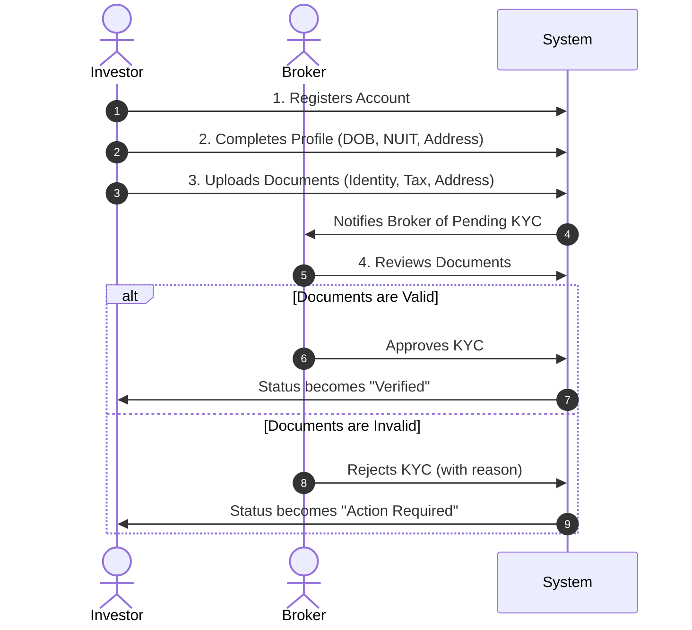
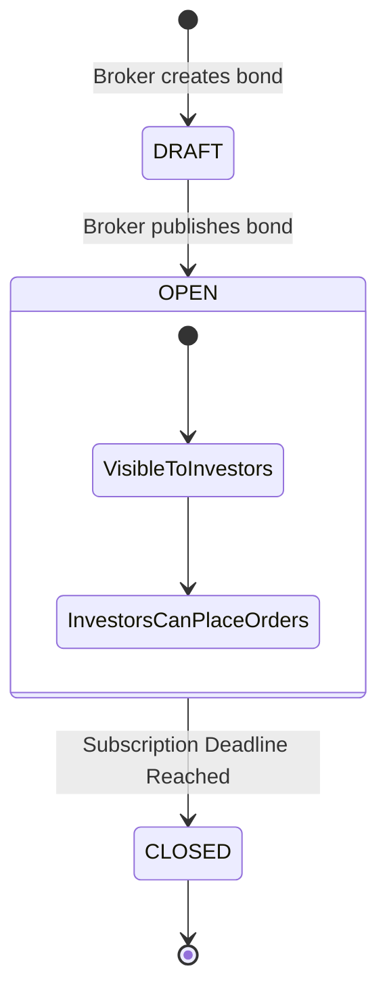
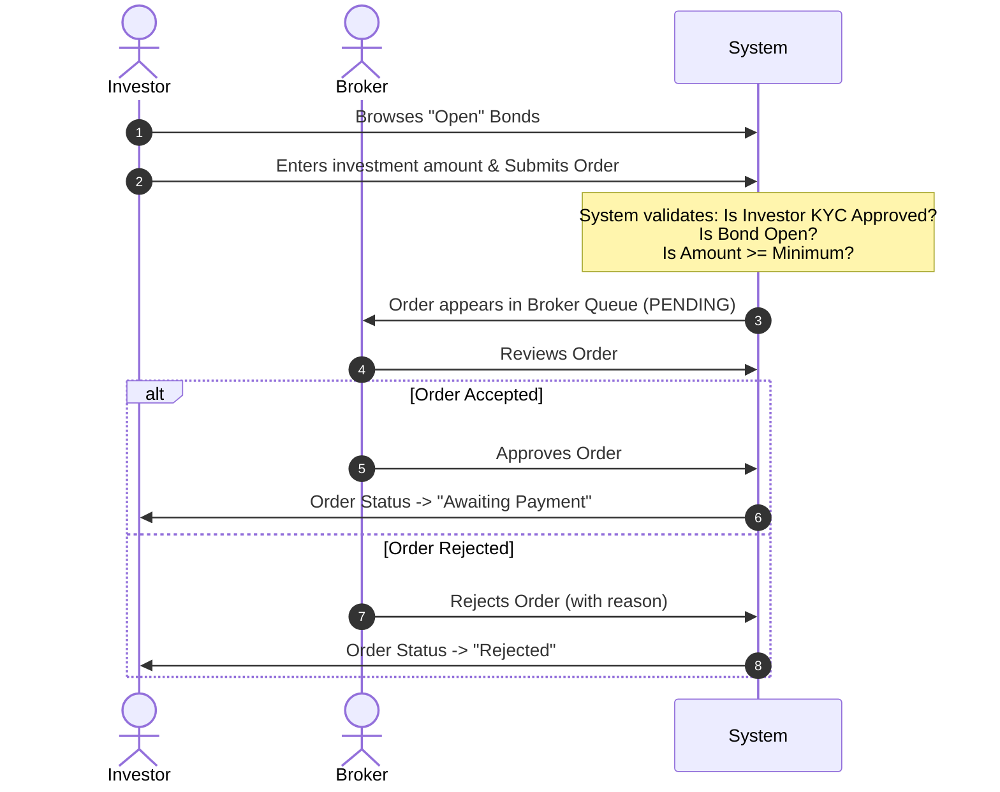

# AFIN Platform - User Manual (Phase 1)

Welcome to the African Fixed Income Network (AFIN) Digital Exchange Platform. This manual explains how the core features of the platform work, up to the Order Placement phase.

## 1. System Roles

The platform currently operates with two primary user roles, each with distinct permissions and responsibilities.

### 👤 The Investor
An individual or institutional user looking to purchase government bonds.
* **Capabilities:** Register, upload KYC documents, browse available bonds in the marketplace, and place investment orders.
* **Restrictions:** Cannot invest until KYC is explicitly approved by a Broker.

### 🏢 The Broker
The licensed financial intermediary managing the exchange.
* **Capabilities:** Review and approve/reject investor KYC applications, create and publish new bonds, and approve/reject incoming investment orders.

---

## 2. Feature Workflows

### 2.1 Onboarding & KYC (Know Your Customer)
Before an investor can participate in the marketplace, they must prove their identity.

### 2.2 Bond Creation & Marketplace
Brokers are responsible for setting up the bonds that investors will see.

**How it works:**
1. The **Broker** creates a Bond in `DRAFT` status, specifying the Yield, Face Value, Minimum Investment, and Dates.
2. The **Broker** clicks "Publish", moving the bond to `OPEN` status.
3. The **Investor** visits the Marketplace. They will only see bonds that are `OPEN`.

---

### 2.3 The Order System
Once an investor is verified and a bond is open, the investment process begins.

### Order Status Lifecycle
* **PENDING_REVIEW**: The investor has submitted the order, and it is waiting for the broker to look at it.
* **REJECTED**: The broker declined the order (e.g., suspected fraud or invalid details).
* **CANCELLED**: The investor cancelled their own order before the broker reviewed it.
* **AWAITING_PAYMENT**: The broker approved the order. The next step will require the investor to wire the money and upload a receipt.

---

## Summary of Completed Capabilities
As of this phase, the system successfully guarantees that:
1. **Security**: Unverified users cannot place orders.
2. **Integrity**: Investors cannot order more or less than the bond's strict limits.
3. **Oversight**: Brokers have total manual control over who gets verified and which orders get approved.
