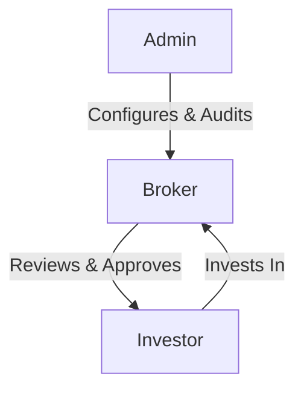
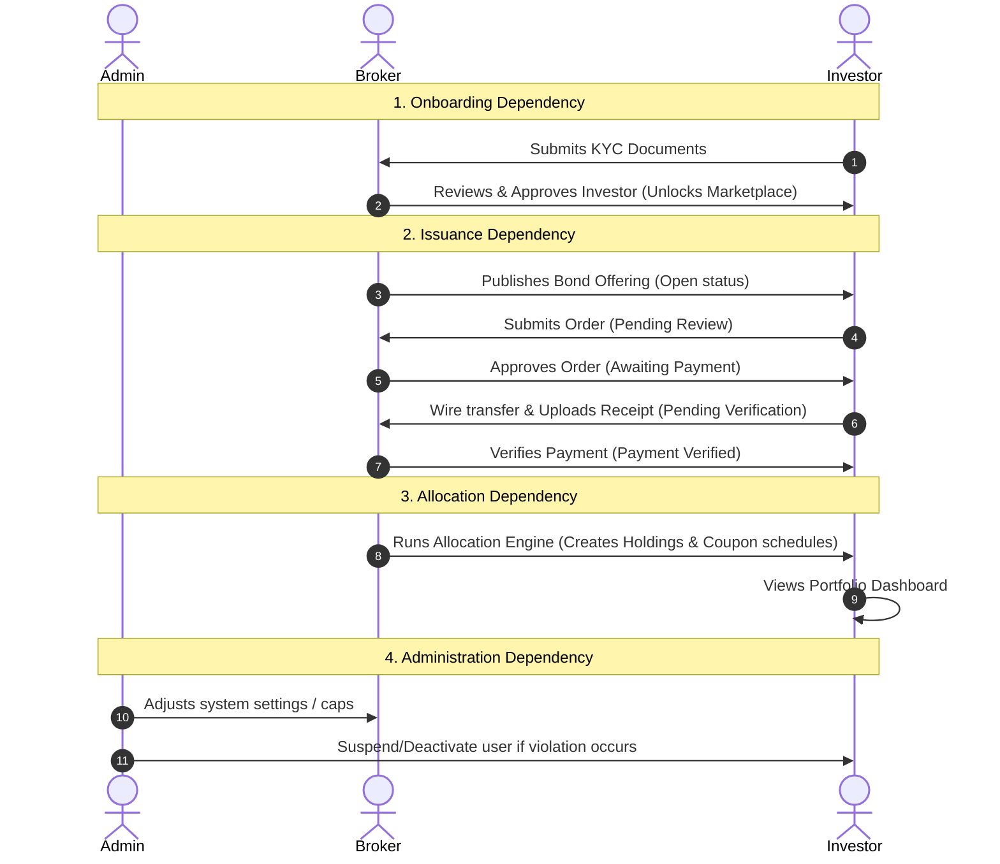

# AGBX Platform - User Manual (Phase 1 MVP)

Welcome to the African Government Bond Exchange (AGBX) Digital Exchange Platform. This manual explains the roles, workflows, and inter-dependencies of the platform through Day 8 (Admin Panel & Security Hardening).

---

## 1. System Roles & Responsibilities

The platform operates with three distinct user roles. Each role has specific responsibilities that work together to ensure a secure, transparent, and fair bond exchange.

### 👤 The Investor
The primary customer looking to purchase government bonds.
* **Responsibilities:**
  * Complete onboarding profile (Date of Birth, NUIT, Address).
  * Upload identification and tax documents for verification.
  * Browse active government bond offerings in the marketplace.
  * Submit investment orders and cancel pending orders.
  * Upload bank transfer payment receipts for approved orders.
  * Monitor personal portfolios, coupon schedules, and transaction histories.

### 🏢 The Broker
The financial intermediary who manages the bond lifecycle and verifies transactions.
* **Responsibilities:**
  * Review and approve/reject investor onboarding and KYC documentation.
  * Design, publish, and close government bond offerings.
  * Review and approve/reject investor orders (moving them to "Awaiting Payment").
  * Verify bank transfer payment receipts uploaded by investors.
  * Run the Pro-Rata Allocation Engine to fairly distribute bonds.
  * Monitor platform KPIs (AUM, volume, active users) and export reports.

### ⚙️ The Admin
The system administrator who manages platform settings, users, and security.
* **Responsibilities:**
  * Manage users (create, edit, suspend, or reactivate accounts across all roles).
  * Revoke active sessions (refresh tokens) of suspended users immediately.
  * Edit dynamic system settings (e.g. maintenance mode, global investment caps).
  * Inspect the Activity Log to audit all user actions on the platform.

---

## 2. How the Roles Depend on Each Other

To ensure maximum financial safety, no single role can complete the investment cycle alone. The roles depend on each other at every step:

1. **Onboarding Dependency:** The Investor cannot view or buy bonds until the Broker reviews and verifies their KYC documents.
2. **Issuance Dependency:** The Investor cannot place orders unless the Broker publishes an active bond. The Investor cannot pay for a bond until the Broker reviews and approves their order.
3. **Allocation Dependency:** The Investor's portfolio cannot be funded and coupon schedules cannot be generated until the Broker runs the Allocation Engine.
4. **Administration Dependency:** Both the Broker and Investor operate under the rules and security bounds configured by the Admin (e.g., maximum global order amounts and security rate limits).

---

## 3. Core Feature Workflows

### 3.1 Onboarding & KYC
Before an investor can buy bonds, they must complete their profile and upload identity proof.

* **Investor Steps:**
  1. Register an account and log in.
  2. Navigate to the profile page and fill out required details (NUIT tax ID, DOB, Address).
  3. Upload clear copies of ID, NUIT, and utility bill.
* **Broker Steps:**
  1. Open the KYC Queue.
  2. Inspect documents.
  3. Click **Approve** (activates investor account) or **Reject** (with a reason, prompting the investor to re-upload).

### 3.2 Bond Lifecycle & Marketplace
Bonds follow a structured status flow managed exclusively by the Broker:

$$\text{DRAFT} \longrightarrow \text{OPEN} \longrightarrow \text{CLOSED} \longrightarrow \text{ALLOCATED} \longrightarrow \text{SETTLED}$$

* **Draft:** The Broker edits bond parameters (coupon rate, face value, maturity date).
* **Open:** The Broker publishes the bond. It is now visible to all KYC-approved investors in the marketplace.
* **Closed:** The subscription deadline passes, preventing new orders.
* **Allocated:** The Broker runs the allocation engine, distributing bonds to portfolios.

### 3.3 The Order & Payment Workflow
When an investor decides to invest, the order goes through the following lifecycle:

1. **Order Submission:** Investor enters an amount and submits the order. The system validates that the investor is verified, the bond is open, and the amount satisfies min/max rules. (Status: `PENDING_REVIEW`)
2. **Order Review:** Broker reviews the order and approves it. (Status: `AWAITING_PAYMENT`)
3. **Payment Receipt:** Investor transfers the funds to the Broker's bank account and uploads the transfer receipt. (Status: `PAYMENT_VERIFIED` once verified by the Broker)
4. **Cancellation:** Investors can cancel their own order at any time before the broker approves it.

### 3.4 Pro-Rata Allocation Engine
When a bond closes, it is often oversubscribed (more demand than supply). The system ensures fairness:
* **Algorithm:** If total demand is greater than bond supply, it calculates a proportional ratio (e.g., `0.5` if demand is double the supply).
* **Application:** Every investor gets their requested amount multiplied by the ratio (rounded down to the nearest bond unit).
* **Payout Generation:** The system automatically builds a scheduled list of **Coupon Payments** (interest payouts) for the investor's active portfolio.

---

## 4. Dashboards & Analytics

### 📊 Investor Portfolio
Investors have a personal dashboard showing:
* **Summary metrics:** Total invested capital, current valuation, and average yield.
* **Active Holdings:** List of all allocated bonds currently held.
* **Coupon Schedule:** Calendar of all future interest payments (and history of paid coupons).
* **Activity Logs:** Chronological log of personal actions.

### 📈 Broker Dashboard & Reports
Brokers have access to platform-wide statistics:
* **KPI Metrics:** Total Assets Under Management (AUM), total verified investors, and total active bond offerings.
* **Data Export:** Generate and download detailed CSV reports for users, orders, active offerings, and total AUM.

### 🛡️ Admin Dashboard & Security Control
Admins can manage platform states and safety:
* **User Management:** View all accounts, create new operators, and toggle status (Active / Suspended). Suspending an account immediately terminates active sessions for security.
* **Settings Management:** Dynamically toggle features (e.g. `PLATFORM_MAINTENANCE_MODE` or adjust `MAX_INVESTMENT_LIMIT_GLOBAL`).
* **Audit Trails:** Browse the system-wide activity log to trace who did what and when.
